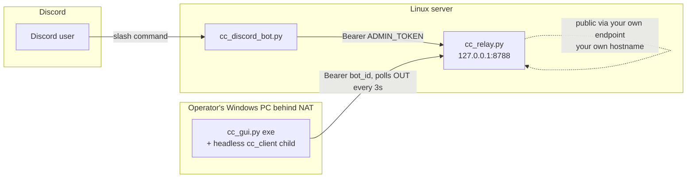
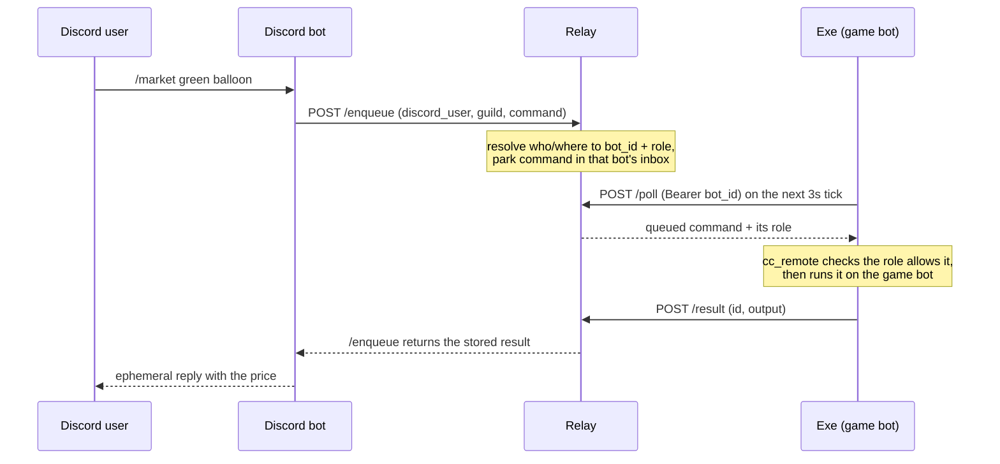
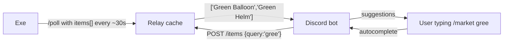

# Cubic Castles remote control — how it all fits together

Three programs cooperate so you can drive an at-home game bot from Discord:

| Piece | Runs on | Language / deps | Doc |
|---|---|---|---|
| **The exe** (game bot + GUI) | each operator's **Windows** PC | Python frozen w/ PyInstaller; frida + tkinter bundled | [EXE.md](EXE.md) |
| **The relay** | one **Linux** server | Python **stdlib only** (`http.server`) | [RELAY.md](RELAY.md) |
| **The Discord bot** | same Linux server | Python + `discord.py` | [DISCORD_BOT.md](DISCORD_BOT.md) |

## The core problem it solves

The exe lives behind a home router (NAT), so **nothing on the internet can connect *into* it**. The relay is the fix: it's a public meeting point that the exe phones *out* to. The exe and the Discord bot never talk directly — the relay sits between them.

- The exe **polls out** to the relay (`/poll`) every ~3s. That's the only direction that works through NAT.
- The Discord bot **pushes** commands to the relay (`/enqueue`); the relay parks them in the exe's inbox until the next poll.
- Your public endpoint fronts the relay so the exe can reach it from any home network. The Discord bot reaches the relay over **localhost** (same box), never back out through it.

## Two secrets, two jobs

| Secret | Held by | Proves | Where it lives |
|---|---|---|---|
| **`bot_id`** | the exe | "I am *this* bot" (the exe↔relay password) | `%APPDATA%\CubicBot\bot_id.json` — **never shown in Discord** |
| **`RELAY_ADMIN_TOKEN`** | the relay + the Discord bot | "I am the trusted Discord bot" | `/etc/cubic-castles/cubic-castles.env` on the server |

"Which exe is yours?" is proven **once** by a one-time **link code** shown only inside the exe's own window; redeeming it in Discord (`/link`) binds your Discord user id to that `bot_id`. After that the relay remembers the binding.

## A command's round trip

`/market green balloon` from a Discord user:

The relay blocks the `/enqueue` call for up to **25s** waiting for the matching `/result`. Long jobs (a full realm scan) don't fit in one window, so those use a **poll pattern** instead — see [DISCORD_BOT.md](DISCORD_BOT.md) (`/scan`, `/guid`).

## Who can do what — permission tiers

The person who **linked** a bot is its **owner**; everyone else in a server where that bot is linked is a **guest**.

- **Guest** — teleport-to-scan and read data only: `/guid`, `/tp`, `/market`, `/dbstats`, `/status`, plus `where`/`players`/`friends` via `/cmd`.
- **Owner** — everything a guest can, **plus** `/scan` (rescan in place), `/park`, `/hwarp`, and `queue`/`webhook` settings.

Two-layer enforcement:

1. **The relay decides the role** from the authoritative bindings (`_resolve_target`) and tags each command `owner`/`guest`. **The server you're typing in wins** — if you own a bot in *another* server you're still a guest of the bot linked *here*.
2. **The exe enforces it** (`cc_remote.command_allowed`) before running anything — it's the real guard. A guest asking for an owner command gets a `🔒 owner only` refusal.

## `/market` autocomplete data flow

Discord's autocomplete must answer in well under a second, far faster than the poll cycle. So the exe **pushes** its scanned item names to the relay, and the Discord bot reads the relay's cache:

Only items the bot has actually scanned appear. Until the owner runs an exe that pushes its list, autocomplete simply shows nothing.

## Where things run / persist

- **Exe data** → `%APPDATA%\CubicBot` on the Windows PC (market DB, `vends.json`, `bot_id.json`, login, logs). See [EXE.md](EXE.md).
- **Relay state** → `relay_state.json` beside `cc_relay.py` (bindings only; inbox/results/items are in-memory). See [RELAY.md](RELAY.md).
- **Server secrets** → `/etc/cubic-castles/cubic-castles.env` (systemd `EnvironmentFile`). See [deploy/README.md](../deploy/README.md).

## Deploying updates

- **Relay / Discord bot** are **server-only and NOT in git** — copy them with `scp` and restart the systemd service. See [deploy/README.md](../deploy/README.md).
- **Exe** ships as a rebuilt binary (or a GitHub Release); each operator runs their own copy.
