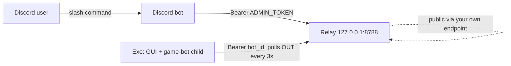
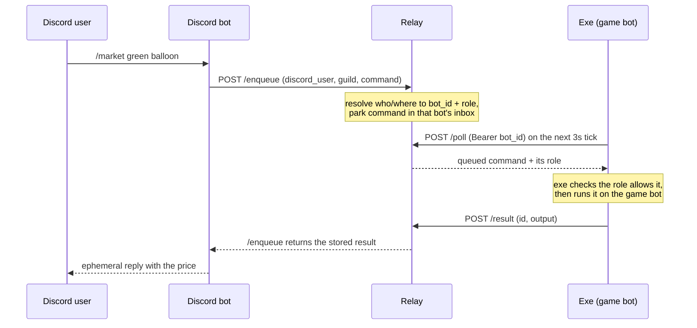
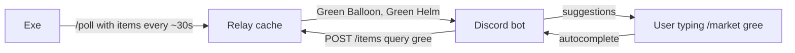

# Cubic Castles remote control — the whole system in one page

Three programs cooperate so you can drive an at-home game bot from Discord.

| Piece | Runs on | Language / deps |
|---|---|---|
| **The exe** (game bot + GUI) | each operator's **Windows** PC | Python frozen with PyInstaller; frida + tkinter bundled |
| **The relay** | one **Linux** server | Python **stdlib only** (`http.server`) |
| **The Discord bot** | the same Linux server | Python + `discord.py` |

---

## 1. The core idea

The exe sits behind a home router (NAT), so **nothing on the internet can connect *into* it**. The relay is a public meeting point the exe phones *out* to. The exe and the Discord bot never talk directly — the relay sits between them.



- The exe **polls out** to the relay every ~3s — the only direction that works through NAT.
- The Discord bot **pushes** commands to the relay; the relay parks them in the exe's inbox until its next poll.
- Your public endpoint fronts the relay so the exe reaches it from any home network. The Discord bot reaches the relay over **localhost** (same box), never back out through it.

### Two secrets, two jobs

| Secret | Held by | Proves | Lives in |
|---|---|---|---|
| **`bot_id`** | the exe | "I am *this* bot" (the exe↔relay password) | `%APPDATA%\CubicBot\bot_id.json` — **never shown in Discord** |
| **`RELAY_ADMIN_TOKEN`** | the relay + Discord bot | "I am the trusted Discord bot" | `/etc/cubic-castles/cubic-castles.env` on the server |

"Which exe is yours?" is proven **once** by a one-time **link code** shown only inside the exe's own window; redeeming it in Discord (`/link`) binds your Discord user id to that `bot_id`. The relay then remembers the binding.

### A command's round trip



The relay blocks `/enqueue` up to **25s** waiting for the matching `/result`. Long jobs (a full realm scan) don't fit one window, so `/scan` and `/guid` use a **poll pattern** instead (kick off, then poll a completion counter).

---

## 2. The exe (game bot + GUI)

A single self-contained Windows program each operator runs on their own PC. It logs into Cubic Castles, drives an in-game bot, and optionally exposes that bot to Discord through the relay.

**Two builds, one codebase** (the GUI picks its mode from the exe's filename):

- `cubic-bot.exe` — **simple** (Logs / Market / Scan / Status)
- `cubic-bot-full.exe` — **full** (adds a Controls tab: Teleport, Park, Help/Where/Players/Friends)

**Inside:**

- `cc_bot_launcher.py` — entry point, starts the GUI.
- `cc_gui.py` — the always-on dark **tkinter GUI**. Spawns and supervises the game-bot child and drives it over a local web-control server.
- `cc_client.py` — the **game bot**: connects to the game server over WebSocket using the saved login, runs the protocol, and hosts the local control server. Runs headless as a child of the GUI.
- `cc_remote.py` — the relay **poll loop** + the **permission guard**.
- `cc_provision.py` — one-time **login capture** (frida), the `bot_id`, remote config.

**First run — login capture:** no login is baked in. The *Set up login* dialog uses the bundled frida runtime + `nopoll_agent.js` to attach to a running `Cubic.exe`, capture the login the moment you sign in, and save it. Frida is used *only* for this capture; the bot then connects to the game server directly over WebSocket.

**Where it keeps data — `%APPDATA%\CubicBot`** (e.g. `C:\Users\<you>\AppData\Roaming\CubicBot`). A `--onefile` exe unpacks to a temp dir that's wiped on exit, so all state goes to this stable per-user folder instead: the market DB (`cubic_market.db`), orders DB, `vends.json` / `realms.json` / `watchlist.json`, `webhook.json`, `approved_users.json`, `quiz_learned.json`, the saved login, `bot_id.json`, `remote.json`, and the bot log. (Running from source instead writes next to the script.)

**Local web-control server** (`127.0.0.1:<random port>` + token) — used by the GUI, browser tools, and the remote worker. Key endpoints: `/status`, `/logs`, `/cmd`, `/runcmd` (returns only a command's own output), `/scan`, `/scanstatus` (running? vend count + completion counter), `/items` (scanned item names, for autocomplete), `/hwarp`, `/park`, `/tp`.

**Remote control** — `cc_remote.RemoteWorker` runs only while linked/enabled: `POST /poll` (pick up commands; every ~30s also push the scanned item list) → check the permission guard → run allowed commands → `POST /result`.

**Resilience:** the game's Cloudflare front end can answer a burst of reconnects with **HTTP 429 / `error code 1015`** (IP-level) + a `Retry-After` header. Auto-reconnect reads it and waits the **full** requested time instead of hammering. In the moment: `reconnect off`, wait it out (~3–4 min).

**Building:**

```bash
python -m PyInstaller --onefile --windowed --name cubic-bot \
  --add-data "nopoll_agent.js;." --collect-all frida \
  --hidden-import websocket --hidden-import cc_protocol --hidden-import send_cipher \
  --hidden-import xxtea --hidden-import cc_storage --hidden-import cc_orders \
  --hidden-import cc_quiz --hidden-import cc_provision --hidden-import cc_remote \
  --hidden-import cc_gui --hidden-import cc_client cc_bot_launcher.py
```

Close any running `cubic-bot*.exe` first. Output lands in `dist\` (~57 MB) and is published as GitHub Releases.

---

## 3. The relay (`cc_relay.py`)

The public meeting point. Stdlib-only HTTP server, bound to localhost, fronted by your own tunnel / reverse proxy. It's a **dumb pipe with a binding table** — it parks commands and hands back results; it does *not* interpret game commands (the exe decides what may run). **Server-only file — not in git; delivered by `scp`.**

**Endpoints** (auth = `Bearer` token):

*Exe-facing (auth = `bot_id`):*

| Endpoint | Purpose |
|---|---|
| `POST /poll` | Register online, drain + return queued commands, optionally push the scanned **item list**. |
| `POST /result` | Hand back a command's output; wakes the blocked `/enqueue`. |
| `POST /linkcode` | Mint a one-time 6-char link code (≤5 per bot per 5 min). |

*Discord-bot-facing (auth = `RELAY_ADMIN_TOKEN`):*

| Endpoint | Purpose |
|---|---|
| `POST /link` | Redeem a code → bind `discord_user` ↔ `bot_id` (+ guild). First-linker-wins. |
| `POST /enqueue` | Queue a command and block up to 25s for its result. |
| `POST /items` | Autocomplete lookup → scanned item names filtered by query. |

No `/unlink` — an exe "unlinks" by rotating its `bot_id` (the old binding goes inert).

**State** (in memory except bindings, which persist to `relay_state.json`):

- `bindings`: `bot_id → {discord_user, guild, at}` — the authoritative "who owns which bot".
- `by_user`: `discord_user → bot_id` (this user **owns** that bot).
- `by_guild`: `guild → bot_id` (which bot a server's **guests** may drive).
- `bots`: `bot_id → {inbox, last_poll, items}` (ephemeral: online status, queued commands, cached item names).
- plus short-lived `results` and link `codes`.

**Env:** `RELAY_ADMIN_TOKEN` (required), `RELAY_HOST` (`127.0.0.1`), `RELAY_PORT` (`8788`), `RELAY_STATE_FILE`.

> Bind the relay to localhost and forward to it from your own public endpoint; keep the forward target on the same IPv4 loopback the relay listens on.

---

## 4. The Discord bot (`cc_discord_bot.py`)

The human-facing front end — people type slash commands, it relays them and shows the answer. **Stateless**: the only secret it holds is `RELAY_ADMIN_TOKEN`; it never handles a `bot_id`. Identity is supplied by Discord (`interaction.user.id`, verified) and passed with the guild to the relay. Every reply is **ephemeral** (private). **Server-only file — not in git; delivered by `scp`.**

**Env:** `DISCORD_TOKEN` (required), `RELAY_ADMIN_TOKEN` (must match the relay), `RELAY_URL` (`http://127.0.0.1:8788`), `DISCORD_GUILD_ID` (leave empty for the normal multi-server model).

---

## 5. Who can do what — permission tiers

The person who **linked** a bot is its **owner**; everyone else in a server where that bot is linked is a **guest**.

| Command | Guest | Owner |
|---|---|---|
| `/guid <player>` — teleport to a player, scan their realm, report vends | ✅ | ✅ |
| `/tp <player\|guid>` — teleport | ✅ | ✅ |
| `/market <item>` — price (auto-suggests scanned items as you type) | ✅ | ✅ |
| `/dbstats` — market DB stats | ✅ | ✅ |
| `/status` — account / connection / realm | ✅ | ✅ |
| `/cmd where / players / friends` — data lookups | ✅ | ✅ |
| `/scan` — rescan the realm it's sitting in | 🔒 | ✅ |
| `/park` — send back to the park realm | 🔒 | ✅ |
| `/hwarp on\|off` — auto-Hollawarp | 🔒 | ✅ |
| `/cmd queue`, `/cmd webhook …` — queue + alert settings | 🔒 | ✅ |
| `/link <code>` — bind a bot with its one-time code | ✅ | ✅ |

**Two-layer enforcement:**

1. **The relay decides the role** from the bindings and tags each command `owner`/`guest`. **The server you're typing in wins** — if you own a bot in *another* server you're still a **guest** of the bot linked *here*, so your command reaches this server's live bot rather than your own (possibly offline) one.
2. **The exe enforces it** (`command_allowed`) before running anything — the real guard. A guest asking for an owner command gets a `🔒 owner only` refusal.

Guests reach a server's bot via `by_guild`, which prefers whichever bot bound to that server is **online right now** — so it works even if the recorded mapping is stale or was never set.

---

## 6. `/market` autocomplete

Discord expects suggestions in well under a second — far faster than the poll cycle. So the exe **pushes** its scanned item names to the relay (on poll, ~every 30s), the relay caches them per bot, and the Discord autocomplete reads that cache:



Only items the bot has actually scanned appear. Until the owner runs an exe that pushes its list, autocomplete shows nothing (gracefully).

---

## 7. Deploying / updating

- **Relay + Discord bot** are **server-only and not in git.** Copy them over and restart the systemd services:
  ```bash
  scp cc_relay.py cc_discord_bot.py <user>@<server>:~/cubic-castles-bot/stage2/
  sudo systemctl restart cc-relay cc-discord-bot
  ```
  (Push *before* restarting — systemd keeps running the old code until then.) Secrets live in `/etc/cubic-castles/cubic-castles.env` (root-only, `chmod 600`).
- **Exe** ships as a rebuilt binary (or a GitHub Release); each operator runs their own copy. It must be the current build for the permission guard, autocomplete push, and rate-limit handling to be present.
- Your **public endpoint** (the tunnel / reverse proxy publishing the relay) is its own separate service.

### Where state / secrets live

| What | Where |
|---|---|
| Exe data (DBs, vends, login, `bot_id`, logs) | `%APPDATA%\CubicBot` on the Windows PC |
| Relay bindings | `relay_state.json` beside `cc_relay.py` |
| Server secrets (`RELAY_ADMIN_TOKEN`, `DISCORD_TOKEN`) | `/etc/cubic-castles/cubic-castles.env` |
